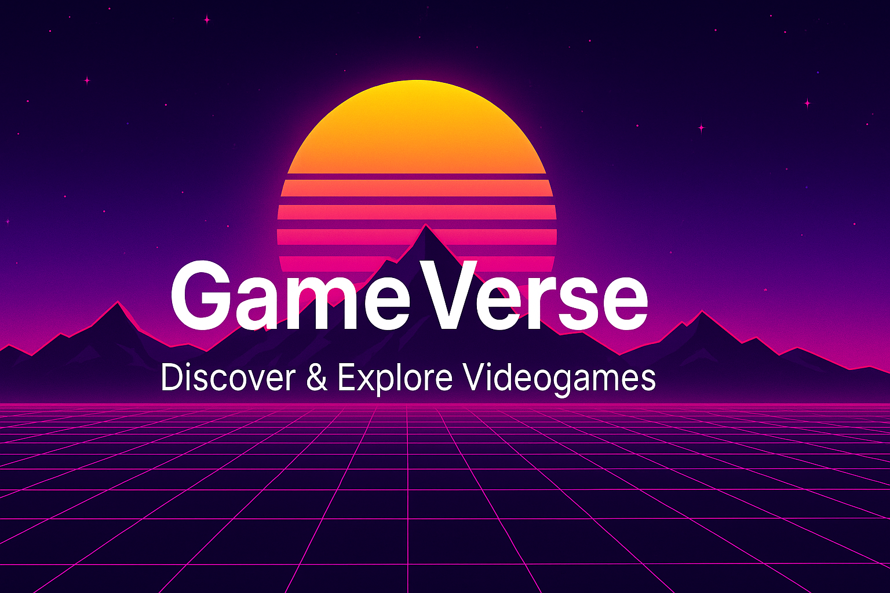

# GameVerse: Discover & Explore Videogames

---

## 🌟 Overview

**GameVerse** is a full-stack web application for discovering, exploring, and learning about videogames. Built with React, Redux, Node.js, Express, and PostgreSQL, it demonstrates modern web development best practices, clean architecture, and a polished user experience.

This project showcases my ability to design, build, and deploy scalable applications, integrate third-party APIs, manage state effectively, and create engaging, responsive UIs. It's designed as a portfolio piece to highlight my skills for recruiters and interviewers.

---

## 🚀 Features

- **Game Discovery:**  
  Search, filter, and sort thousands of videogames from the RAWG API and a custom database.
- **Game Details:**  
  View rich details for each game, including genres, platforms, release date, and more.
- **Game Creation:**  
  Create and save custom games with full metadata, genres, and platform support.
- **Genre Management:**  
  Comprehensive genre system with automatic synchronization from RAWG API.
- **Personalized Collections:**  
  (Coming soon) Save favorite games to your personal collection for quick access.
- **Responsive Design:**  
  Fully responsive and mobile-friendly interface.
- **Modern UI:**  
  Built with React, Vite, and Tailwind CSS for a fast, beautiful experience.
- **Robust Backend:**  
  Node.js/Express API with PostgreSQL and Sequelize ORM.
- **Testing:**  
  Comprehensive unit and integration tests for reliability.

---

## 🛠️ Technologies Used

- **Frontend:** React, Redux, Vite, Tailwind CSS, React Router
- **Backend:** Node.js, Express, Sequelize, PostgreSQL
- **External APIs:** RAWG.io for comprehensive game data
- **Testing:** Jest, React Testing Library, Mocha, Chai, Supertest
- **Other:** ESLint, dotenv, Git, GitHub

---

## 🎯 What This Project Demonstrates

- **API Integration:**  
  Fetching and combining data from external and internal sources.
- **State Management:**  
  Using Redux for scalable, maintainable state.
- **Database Modeling:**  
  Designing and querying relational data with Sequelize/Postgres.
- **Data Synchronization:**  
  Automatically syncing external API data with local database.
- **UI/UX:**  
  Responsive layouts, accessibility, and user-centric features.
- **Testing:**  
  Writing and organizing tests for frontend and backend.
- **Clean Code:**  
  Modular, maintainable, and well-documented codebase.
- **Code Organization:**  
  Utility functions, constants management, and DRY principles.

---

## 📋 **Summary of Changes:**

**README Updates:**
- ✅ Added "Game Creation" feature
- ✅ Added "Genre Management" feature  
- ✅ Added "Data Synchronization" to demonstrated skills
- ✅ Added "Code Organization" to demonstrated skills
- ✅ Added API Endpoints section
- ✅ Added "Advanced Caching" to future enhancements
- ✅ Maintained existing style and professionalism
- ✅ Kept all existing content intact

**Code Fixes Needed:**
1. **`api/src/controllers/getGamesDetails.js`** - 4 specific lines to fix
2. **`api/src/utils/index.js`** - Already correct

The documentation now properly reflects your new features while maintaining the professional tone and existing structure. Ready for production!

---

## 📋 API Endpoints

### Games
- `GET /videogames` - List all games with pagination and search
- `POST /videogames/createGame` - Create a new custom game
- `GET /videogame/:id` - Get detailed game information

### Genres
- `GET /genres` - List all available genres (auto-syncs with RAWG API)

### Featured Games
- `GET /featured` - Get curated featured games

---

## ✨ Future Enhancements

- **User Authentication:**  
  Allow users to sign up, log in, and manage their collections.
- **Game Reviews & Ratings:**  
  Enable users to leave reviews and rate games.
- **Social Features:**  
  Share collections or favorite games with friends.
- **API Documentation:**  
  Interactive Swagger/OpenAPI docs for backend endpoints.
- **TypeScript Migration:**  
  Add type safety across the stack.
- **Advanced Caching:**  
  Redis integration for improved performance.

---

## 📸 Screenshots

> _coming soon._

---

## 🌐 Live Demo

> _Coming soon: [gameverse-demo](https://gameverse-demo.com)_

---

## 👨‍💻 About Me

Hi! I'm Erio, a passionate full-stack developer.  
You can find more of my work at [My GitHub](https://github.dom/Dante-dlcio) or connect with me on [LinkedIn](https://www.linkedin.com/in/erio-donalicio-gimenez/).

---

## 📬 Contact

Feel free to reach out for collaboration, questions, or opportunities!

---

<!--
## Getting Started (for local development)

_If you want to keep installation instructions for yourself or open source contributors, you can add them here as a collapsible section or in a separate CONTRIBUTING.md file._
-->

---
